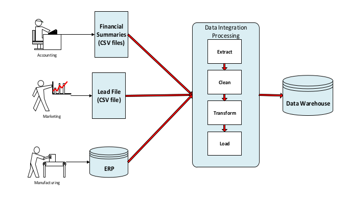

# CPI-Card-group-data-warehouse
Data warehouse is a crucial source of data for business intelligence.
This project contains numerous processes to build data warehouse by implementing Extract the data from its sources then transform it after that load it in data warehouse.    
#  Overview 
The data warehouse uses three data sources as depicted in Figure 1. The ERP
database is the major data source used by manufacturing to manage jobs, subjobs,
shipments, and invoices. The lead file and financial summaries are secondary data
sources, both in spreadsheet format. The lead file and financial summary are prepared
from other data sources used by the marketing and accounting departments.
you can see some details about data sources by opening  details pdf . 

<h4>
 Figure 1:Data Sources for the ABC Data Warehouse 
</h4>

# Business Reporting Needs 
The main purpose of the data warehouse is to track and compare sales and costs
for major dimensions across time periods. Sales should also be compared to invoiced
amounts for major dimensions and time periods. Costs should be tracked by component
for labor, machine, overhead, and material in addition, planning performance should be
evaluated by comparing sales to forecasts and costs to budgets.
## Job and Shipment Performance and Trends
* What are job revenue trends by location over time?
* What are sales agent productivity from leads to jobs over time?
* What are shipment trends for jobs (contract time to shipment) for entities over
time as compared to shipment promised dates and first shipping dates?
## Invoice Trends
* Which customers generate the highest invoice amounts over time?
* Which Locations generate the highest invoice amounts over time?
* Which products generate the highest invoice amounts over time?
## Financial Performance
* What are the gross margins for a location?
* What are the gross margins for a location?
# Running the project
1. you should have postgres & pgadmin4.
2. run pgadmin4 then create database and name it erp.
3. click the right button on the erp database and select Restore.
4. enter the path of epr.sql file which is located inside data sources directory then click OK.
5. create database and name it erp dw.
6. click the right button on the erp dw database then select Query Tool.
7. copy the content of ProdDWPostgreSQLCreate.sql which is located inside data sources directory.
8. paste it in sql query tool then press F5.
9. run "ETL For CPI Card Group.ipynp" using vscode or Jupyter Note book.
10. run all the cells to perform ETL for each table in erp and csv files to load the data in data warehouse.
11. using pycharm open invoice_report.py and run terminal then type (streamlit run invoice_report.py) .
12. the web app is opened so you can see all reports.
# Requirements 
* Python >=3.7.
* Postgres 14.x & pgadmin4.
* streamlit .
# Details 
you can find some details 